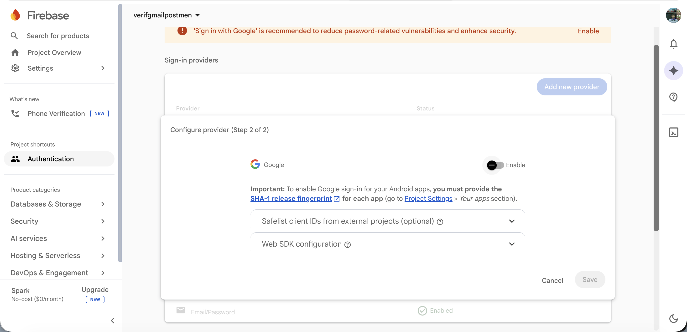
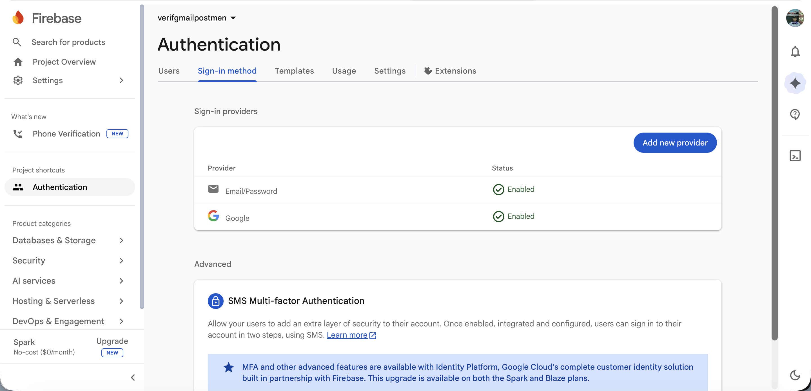
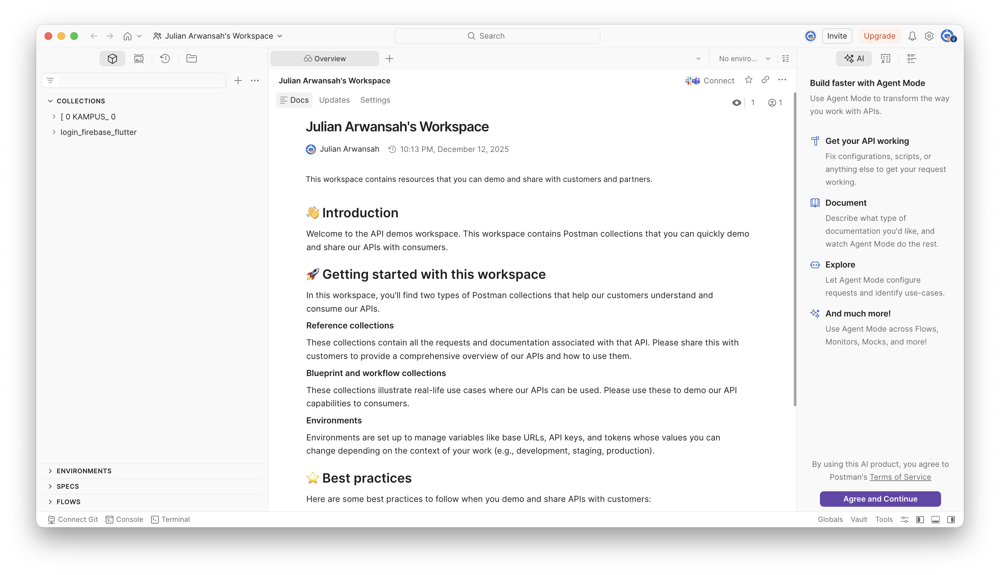
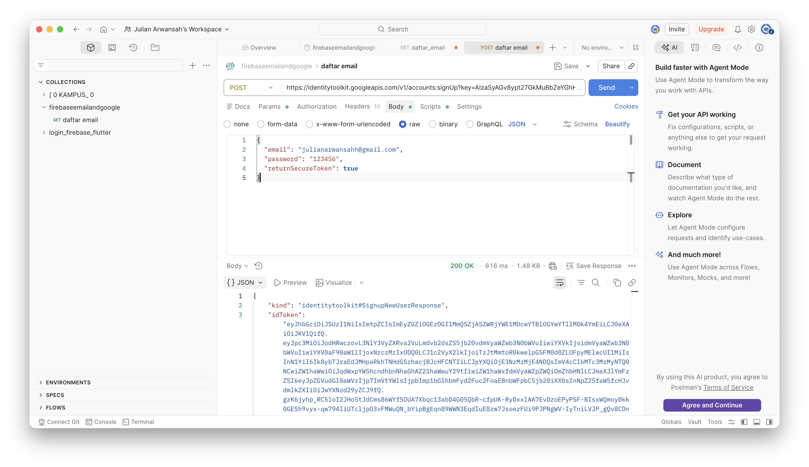
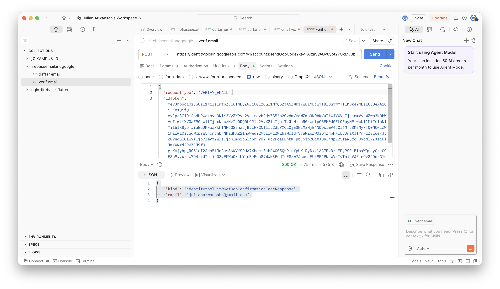
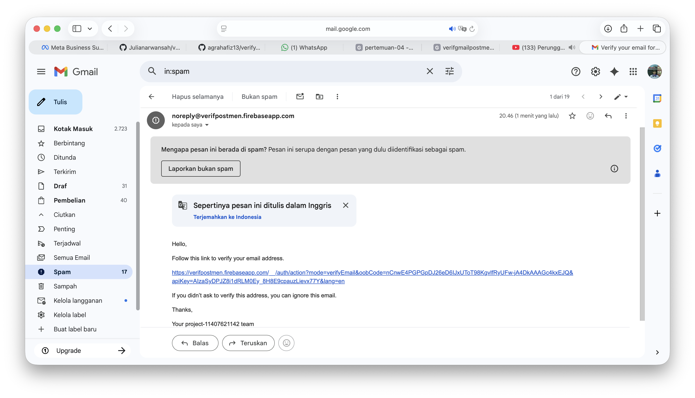
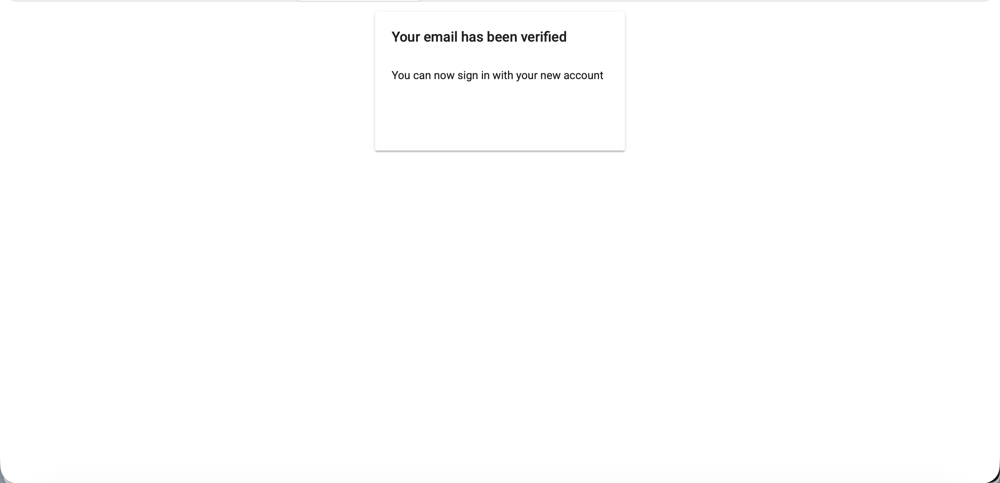
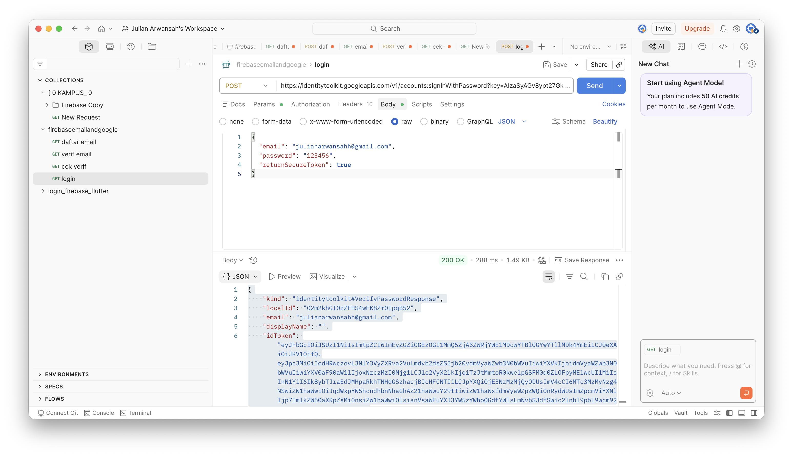
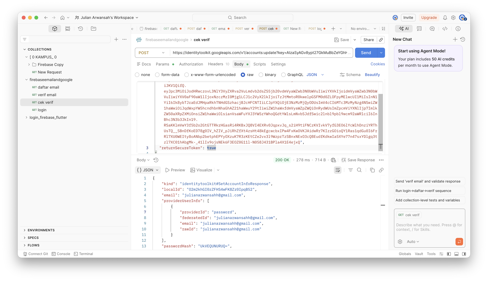

# Verif Email Firebase

1. Input Nama

---

2. Daftar Project

---

3. Bikin Project

---

4. Pilih Authentication

---

5. Sign-in Method

---

6. Enable Email/Password

---

7. Berhasil Terbuka

---

8. Enable Google Auth

---

9. Berhasil Tambah Google

---

10. Buka Postman

---

11. Berhasil Registrasi Email

---

12. Verif Email Postman

---

13. Verif Berhasil Masuk Gmail

---

14. Verif Berhasil

---

15. Berhasil Login

---

16. Cek Verif Email

